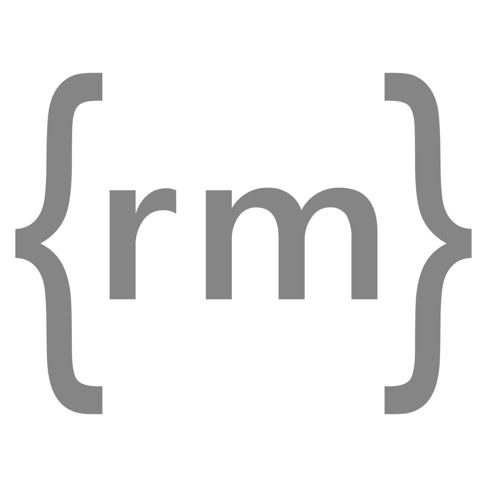

 

<h1 align="center">remark-magic-link</h1>

🔌 A remark plugin to turn <code>{text}</code> syntax into links, optionally with an icon

 

<a href="https://remark-magic-link.aelita.me/">📚 Documentation</a>

 

## License

[MIT](https://github.com/xsjcTony/remark-magic-link/blob/main/LICENSE) License © 2024-present [Aelita (Tony Jiang)](https://aelita.me/)
